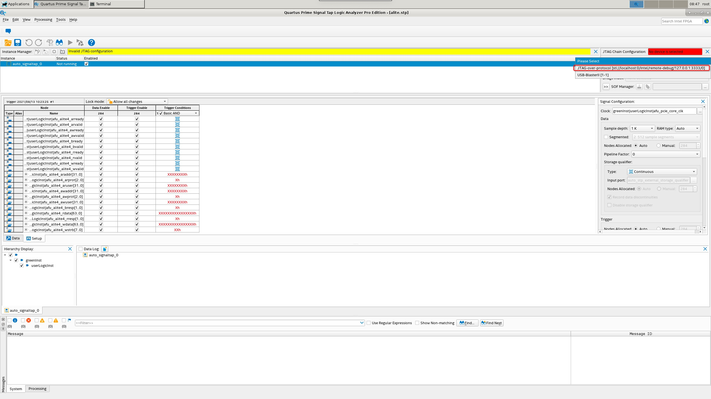

# Remote Stp
## 工程说明
该example以hellow_world工程为基础，详细解释说明如何基于remote stp进行调试。
## 关于逻辑工程
使用remote stp功能用户需要在自己的设计中添加SignalTap II，关于SignalTap II的使用方式可参照Intel官方文档:[《Design Debugging Using the SignalTap II Logic Analyzer》](https://www.intel.com/content/dam/www/programmable/us/en/pdfs/literature/hb/qts/qts_qii53009.pdf?wapkw=signaltap)  
用户在自己的工程中使用remote stp功能时建议通过GUI方式添加SignalTap II及工程运行 

## Remote Stp启动
**用户FPGA镜像烧写进FPGA后同时需确保Host端有安装Quartus及OPAE软件栈方能使用Remote Stp功能。**
1. 运行mmlink 

```bash
sudo mmlink  -P 3333 -B 0x86 -D 0x0 -F 0x0
 ------- Command line Input START ----

 Segment               : -1
 Bus                   : 134
 Device                : 0
 Function              : 0
 Socket-id             : -1
 Port                  : 3333
 IP address            : 0.0.0.0
 ------- Command line Input END   ----

PORT Resource found.
Server socket is listening on port: 3333
```

&emsp;&emsp;mmlink中-B、-D、-F分别对应FPGA的Bus Number、Device Number、Function Number。以本机测试环境为例,通过lspci可查看对应的FPGA设备： 
```bash
$lspci |grep 1ded:8103
86:00.0 Ethernet controller: Device 1ded:8103
``` 
Bus Number、Device Number、Function Number分别是0x86,0x0,0x0。
&emsp;&emsp;mmlink为OPAE中自带的工具，若不适用OPAE,在HDK中也提供了一个mmlink工具，安装后会自动安装到机器上，可通过下面的指令执行：
```bash
sudo ./mmlink -s 86:00.0
 ------- Command line Input START ----

 Segment               : -1
 Bus                   : 134
 Device                : 0
 Function              : 0
 Socket-id             : -1
 Port                  : 3333
 IP address            : 0.0.0.0
 ------- Command line Input END   ----

PORT Resource found.
Server socket is listening on port: 3333
```
&emsp;&emsp;通过-s制定pcie bdf设备。
2. 运行jtagconfig
运行下述指令创建virtual jtag: 

```bash
jtagconfig --add JTAG-over-protocol sti://localhost:0/intel/remote-debug/127.0.0.1:3333/0
```

执行完成后通过下面指令可查看virtual jtag是否建立成功 

```bash
jtagconfig --debug
1) JTAG-over-protocol [sti://localhost:0/intel/remote-debug/127.0.0.1:3333/0]
   (JTAG Server Version 21.1.0 Build 169 03/24/2021 SC Pro Edition)
  020D10DD   VTAP10 (IR=10)
    Design hash    8A109E053E9682B6D434
    + Node 00406E00  Virtual JTAG #0
    + Node 30006E00  Signal Tap #0

  Captured DR after reset = (020D10DD) [32]
  Captured IR after reset = (155) [10]
  Captured Bypass after reset = (0) [1]
  Captured Bypass chain = (0) [1]

2) USB-BlasterII [1-1]
   (JTAG Server Version 21.1.0 Build 169 03/24/2021 SC Pro Edition)
  0341B0DD   AGFB027R25AR0 (IR=10)
    Design hash    FFEB1B190E9CA2D12CF5
    + Node 08706E00  (110:14) #0

  Captured DR after reset = (0341B0DD) [32]
  Captured IR after reset = (001) [10]
  Captured Bypass after reset = (0) [1]
  Captured Bypass chain = (0) [1]
  JTAG clock speed auto-adjustment is enabled. To disable, set JtagClockAutoAdjust parameter to 0
  JTAG clock speed auto-adjusted to 6 MHz due to failure in BYPASS test

```

可以看到，JTAG-over-protocol已经建立成功且已正确识别到设备。
3. 执行下面的指令可启动SignalTap: 

```bash
quartus_stpw alite.stp
```

alite.stp为设计中所添加的SignalTap对应的文件。  


右上角选择JTAG-over-protocol即可，后续所有的抓线调试操作与正常使用物理JTAG没有差别
## 应用代码修改
若使用Remote Stp功能，软件代码中fpgaOpen函数的使用稍有不同，需做修改： 

```C
// Open accelerator
//r = fpgaOpen(accel_token, &accel_handle, 0);
r = fpgaOpen(accel_token, &accel_handle, FPGA_OPEN_SHARED);
```
